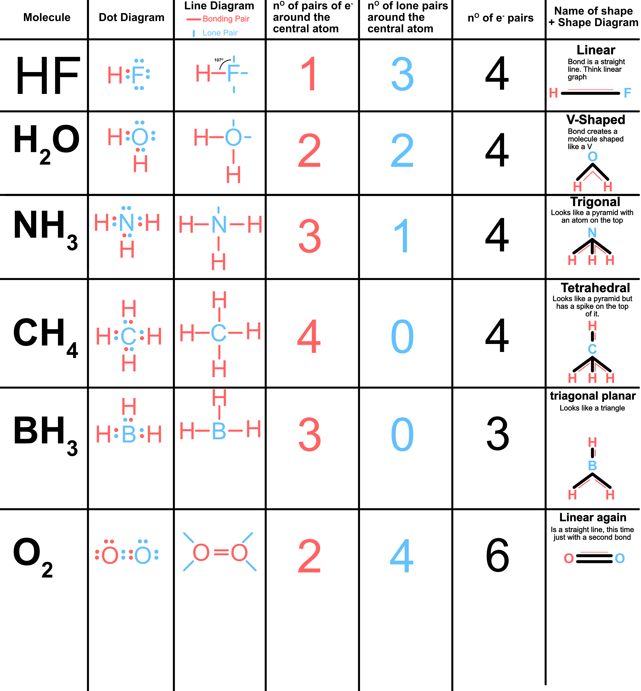

# lesson 11
  ### % Composition

  **difference between a compound and a molecule**
  ```
  compound: A compound is made of more than one type of element.
  molecule: A molecule is a group of elements that doesn't have to be the same type
  ```
  **Everything around us is typically made up of more than one element. Some things on this earth are made up of a single substance such as;**
  ```
  gold: pure Au,
  hydrogen: H,
  silver: Ag,

  Lots of these elements are rare.
  ```
  **Why do most things not exist in our earth as pure substances?**
  ```
  Like ionic compounds, most stable react together naturally. Different areas on the periodic table are more reactive than others.
  ```
  **What percent of the mass of water is made up of oxygen?**

  > **How to find the mass of water?**
>  ```
Find mass number of hydrogen: 1,
Find mass number of oxygen: 16,
Oxygen is made up of: (2 * H) + (1 * O),
Substitute in values: (2 * 1) + (1 * 16),
Mass of water: (2 + 16),
Mass of water: (18)
```
> **Finding % composition of oxygen in water**
>  ```
(Mass of oxygen / Mass of water) * 100,
;
example:
%O: (16 / 18) * 100
%O: (0.8889) * 100
%O: 88.89% Oxygen
```
> **Finding % composition of grams of a substance**
> ```
example:
72g of hydrocarbon has 12g of hydrogen. What is % of carbon?
Carbon: 60g,
Hydrogen: 12g,
;
Molar mass of carbon: 12,
Molar mass of hydrogen: 1,
;
Number of moles of carbon: 60g / 12amu = 5 moles of carbon,
Number of moles of hydrogen: 12g / 1amu = 12 moles of hydrogen,
;
%C: (5 / (5 + 12)) * 100
%C: (5 / 17) * 100
%C: 29%
```

**Emperical vs Molecular formula**
  > ```
Molecular formula: Shows the actual number of each atom within a molecule.
example: C2H4
;
Emperical formula: smallest whole number ratio of each atom within a compound.
example: CH2
```
> **Finding emperical from molecular**
> ```
You have to find the number of each atom then find the lowest ratio of the atoms.
example;
;
Mg3Cl6
Mg: 3, Cl: 6. <-- find the amount of each atom
1 : 2<-- find lowest ratio
MgCl2 <-- change name  to match
```

------------------------------------------------------------------------

# Lesson 12

### Doing the magnesium prac. We have to burn magnesium to create magnesium oxide: MgO;

##### What could affect the purity of our compound in this experiment?
```
1. There are more elements than just oxygen in the surrounding air.
2. Nitrogen will also react with magnesium and compete to make magnesium Nitride instead of magnesium oxide.
3. The masses we get from the balances could cause systematic errors
4. Human errors; table bumps, fuckin bad measurements etc.
5. Some of the magnesium might not react and leave some sort of residue.
6. Some of the magnesium may have already reacted with the air. We need to rub this magnesium oxide off.
```
------------------------------------------------------------------------


# lesson 13
#### Empirical Formula (simplest whole number of atoms) ####

**How to find Emperical formula from % of atoms**

```
42.9% C == 57.1% O;
assumed 100g;
42.9g C, 57.1g O;

n = m/Me: Divide these numbers by their respective molar mass;
example:  42.9 / C --> 42.9 / 12 --> 3.57
example: 57.1 / O --> 57.1 / 16 --> 3.57

to find the ration divide the number by the smallest number:
3.57 / 3.57 --> 1 --> ration = 1:1;

So now u have the ratio and u just apply it to the formula:
CO = CO;
```
**example 2**
```
9.6g C, 0.67g H, 4.7g Cl;
9.6 / 12 = 0.8, 0.61 / 1 = 0.67, 4.7 / 35.5 = 0.13;

0.8/0.13 = 6, 0.67/0.13 = 5, 0.13/0.13 = 1;
ratio = 6:5:1
C6H5Cl
```
**What if i get 2.5 of an atom**
```
If you get 2.5 of an atom then multiply by 2.
example:
  82.75 C / 12 = 6.89
  17.25 H / 1 = 17.25

  16.25 / 6.98 = 2.5
  ratio = 1 : 2.5  --> * 2
  ratio = 2 : 5
  C2H5
```

------------------------------------------------------------------------

## Lesson 14
#### molecular formula
**What is molecular formula**
```
Molecular formula is the actual formula of the compound. The empirical
formula just gives us a ration of atoms whilst the molecular Shows us
exactly how many atoms there are.
```
**Empirical ---> Molecular**
```
Empirical formula is a ratio of atoms.
HO ---> H2O2
It is also a ratio of mass
17 ---> 34
You can see that the molar mass of H2O2 is double the molar mass of HO because it is a ratio

The ratio of the atoms = 34/17 = 2

Mass of empirical formula * ratio = Mass of molecular formula

Mass of molecular formula / Mass of empirical formula = ratio
```
---------------------------------------------------------------------

## Lesson 15
**Quantifying solutions**
```
When we get an error we should be able to figure out how much they affected the data.
We must quantify the errors.
```
**Revision for Formulae of units**
```
Questions + Answers:
1. The mole concept enables us to 'count' particles present in a quantity of a substance. what unit measures the amount of a substance?:
  Mole (mol)
2. How many particles are in a mole?
  3.06 × 10^23
3. Molar mass is represented by M, what units is it expressed in?
  grams/mol
4. What formula helps determine the number of particles in a sample?
  Molar mass × mass × mol
5. The difference between the relative molecular mass M, of carbon dioxide and the molar mass of carbon dioxide
is that the relative molecular mass and the molar mass of carbon dioxide are respectively:
  A. 44.0g and 1 mol
  B. 44.0 and 44.0g/mol   <--- This one. RAM does not HAVE to have a unit following it [although you can use amu]
  C. 44.0g and 44.0g/mol
  D. 44.0 and 44.0g
6. The smallest number of molecules would be contained in:
  A. 1.0g of N2
  B. 1.0g of O2
  C. 1.0g of NO
  D. 1.0g of NO2 <--- This one. Calculate Molecular mass of each one, Molar mass = Mass / Molecular Mass
7. Polymers made from three monomers acrylic acid, C3H4O2, methyl acrylate C4H6O2 and acrylonitrile, C3H3N. The order of increasing percentage carbon content of these monomers is:
  Acrylic acid, methyl acrylate, acrylonitrile.
```
**Revision for empirical and Molecular Formulae**
```
1. How is empirical formula different to the molecular formula:
  The empirical formula shows the ratio of atoms.
```
## Lesson 16
**Bhors theory of shells**
```
  The idea is that electrons are arranged into shells aka; clouds, energy levels, layers or rings.
  They arranged according to energy levels.

  The first shell is the 's' shell. it can hold 2 electrons.
  The second shell is the 'p' shell. it can hold 6 electrons.
  The third shell is the 'd' shell. It can hold 10 electrons.

```
-----------------------------------------------------------------------------

## Lesson 17 ##

**The amazing things about the periodic table**
```
Just by looking at the periodic table you can learn a lot of different things such as:

Shells: You can see which shell the element is in by counting the number of groups.
Electrons: You can see how many electrons are in all elements except the transition metals by counting the number of periods.
Valence electrons: You can see the amount of valence electrons by the charge of the period.
Charge of element: You can find the charge of the element by adding numbers a the top.
Judge the reactivity: You can judge the reactivity of an element by where it is positioned on the table.
Electronegativity: You can judge the Electronegativity of an element by where it is on the periodic Table.
The type of shell its in: You can tell the number of electrons it can hold in its outer shell it is positioned in.
Number of valence electrons: The group number tells us the amount of valence electrons in valence shell.
The mass number: You can tell the mass number by the element symbol.
```


**Trends on the periodic table**
```
Atomic radius trend:
  The atomic radius is the distance between the nucleus of two atoms. This distance is measured in pico-meters.
  Atomic radius increases from left to right and up to down. This means the elements with the largest atomic radius are in the bottom left corner.
  Basically as you go down the amount of shells increases to the radius increases.
  As you go right the amount of electrons increases pulling force between the electrons and protons meaning the atom shrinks a little.

Melting point:
  Metallically bonded and macromolecular substances have high melting points because there is more energy needed to break their bonds.
  Most non-metal have a simple molecular structure and are easy to break the bonds. The strength of the molecular bonds is determined by the size of the molecule.

Electronegativity:
  Electronegativity is a measure of tendency of an atom to attract a bonding pair of electrons. The Electronegativity increases from bottom left to top right.
  The increase in Electronegativity is because the nuclear charge of the atom becomes increasingly positive and the constant shielding effects result in greater attractive forces

Ionization energy:
  The ionization energy generally increases from left to right. Electrons in p orbitals are easier to remove than those in s orbitals of the same energy level. If a paired electron is in the same orbital it can lead to repulsion.
```

**Needed equations**
```
Avagadro's constant (NA): 6.02 × 10^23 mol
Charge on one electron: -1.60 × 10^-19
Faraday constant (F): 96,500 C mol
Gas constant(R): 8.31 J K mol
Ionic product for water (Kw): 1 × 10^-14 mol^2 L^-2 at 298 K
Specific heat capacity (c) of water: 4.18 J/g K
Density (d) of water at 25C: 1.00 g / mL
0 C : 273 K
```

**Shielding effect**
```
The electrons on the outer shell are easier to be taken away because their are electrons shielding the magnetism to them.
Shielding happens because the inside electrons are standing in the way of the outside (valence) electrons.
```

--------------------------------------------------------------------------

## Lesson 18 ##

**Bhor's Shells**
```
Shells = layers of electrons;
  Different energy levels in each shell;
  Closer shells have higher energy levels;

Evidence for this?
  Emission light spectra;
    * Heat a chemical.
    * When Atoms are heated their electrons will rapidly change energy levels / shells.
    * When the electrons fall back they release energy in the form of light.
```

```
Ground state:
  When an electron is in its lowest energy level it is in its ground state.
  So it is in its ground state when it is nearest to the nucleus.
```


**Shell types**

| Shell # | Shell Name | # of electrons | Notes |
| :------ | :--------- | :--- | :--- |
| 1 | K | 2 | |
| 2 | L | 8 | |
| 3 | M | 18 | Only for first 20 |

**Bhors model is shit**
## **SHRONGDONGERS MODEL!** ##
```
There are smaller regions of space than shells.
  * Subshells
Then even smaller than subshells we have.
  -> orbitals

Like orbitals we fill the lowest energy space first. In this case; The orbitals and then the subshells and then the shells.
```
**The Periodic Table in terms of orbitals**

| Shell # | # of Subshells | Name of subshells | # of orbital in subshell | Max electrons |
| :------ | :--------- | :--- | :--- | :--- |
| 1 | 1 | s | s=1; | 2×1 = 2 |
| 2 | 2 | s+p | s=1; p=3; 4| 4×2 = 8 |
| 3 | 2 | s+p | s=1; p=3; 4 | 4×2 = 8 |
| 4 | 3 | s+p+d | s=1; p=3; d=5; 9 | 9×2 = 18 |
| 5 | 3 | s+p+d | s=1; p=3; d=5; 9 | 9×2 = 18 |
| 6 | 3 | s+p+d | s=1; p=3; d=5; 9 | 9×2 = 18 |
| 7 | 4 | s+p+d+f | s=1; p=3; d=5; f=7; 16 | 16×2 = 32 |
| 8 | 4 | s+p+d+f | s=1; p=3; d=5; f=7; 16 | 16×2 = 32 |


**Filling electron shells**
```
Fill the lowest level electrons first

Fill it like a bucket;

1s1,
1s2,
1s2 2s1,
1s2 2s2,
1s2 2s2 2p1,
1s2 2s2 2p2,
1s2 2s2 2p3,
1s2 2s2 2p4,
...
1s2 2s2 2p6 3s2 3p1,
1s2 2s2 2p6 3s2 3p2,
...
1s2 2s2 2p6 3s2 3p6 4s2 3d1,
1s2 2s2 2p6 3s2 3p6 4s2 3d2,
1s2 2s2 2p6 3s2 3p6 4s2 3d3,
...
1s2 2s2 2p6 3s2 3p6 4s2 3d10 4p1,
1s2 2s2 2p6 3s2 3p6 4s2 3d10 4p2,
```
**Example:**
```
  * 11-Na
    -> 1s2 2s2 2p6 3s1
  * 1-H
    -> 1s1
  * 15-P
    -> 1s2 2s2 2p6 3s2 3p5
  * 26-Fe
    -> 1s2 2s2 2p6 3s2 3p6 4s2 3d6
```

--------------------------------------------------------

## Lesson 20 ##

**What is meant by ground state and excited state?**
```
To show ground state and excited state we can use the flame test;
  * With the flame test we put different substances into a flame and then observe the color of the flame.
  * In a flame test the electrons in the substance are going from their ground state to their excited state and back to ground again.
```
**flame test**


**Example**
```
Na = 1s2 2s2 2p6 3s1

When you heat up / excite the electrons in Na, the shrongdonger model could become:

Na = 1s2 2s2 2p5 3s2

As you can see the 2p subshell lost 1 electron and the 3s subshell gained an electron.
If an atom's shrongdonger model has an electron missing in one shell and an extra in another then it is in its excited state.

When an electron goes back into the ground state it fills up the shell that is missing the electron.
```
**Looks like this**


**Ions in the shrongdonger model**
```
If you have an ion in the electron configuration; e.g.
Mg = 1s2 2s2 2p6 3s2
Mg 2+ = 1s2 2s2 2p6

When you have a positive ion, it means that the atom has lost electrons.
In this case the magnesium has lost 2 electrons.
So when you write the electron configuration you have to remove 2 electrons from it.

Because of this if you can only see the electron configuration you cannot tell whether it is an atom or an ion.
```

**Identifying Excited State**
```
If an element's inner shell is not filled up and the outer shell is more filled up then it has excited electrons.
```
-------------------------------------------------------

## Lesson 21 ##
```
Example question:
  1s2 2s2 2p6 3s2 3p6 4s2 3d6
  1s2 2s2 2p6 3s2 3p6 4s2 --> 1s2 2s2 2p6 3s2 3p6 4s1 3d1 [excited state]
```
**Weird textbook thing:**
```
Sometimes textbooks write the d shell before the next s shell. This makes it confusing to find the shell.
for example:
  1s2 2s2 2p6 3s2 3p6 3d6 4s2 === 1s2 2s2 2p6 3s2 3p6 4s2 3d6
if you see it like this then it is usually best to just change it back to the way ur used to.
```

**Core Charge**
```
Electrons are attracted to the nucleus by electrostatic forces.
  * Electrons are negative and protons are positive. Therefore they attract each other.
  * This attraction results in an electrostatic force.

There are two factors that have a major influence on the Electronegativity of the object;
  --> Core Charge
    * The positive charge created by the nucleus of the atom.
    * For example; a carbon atom has 6 protons therefore a core charge of +6;
  --> Distance to outer shell
    * The distance between the nucleus and the outer shell electron negatively effects the amount of positive charge acting on the electron.
    * Electrons that are in between the outer shell and the nucleus 'Shield' the electron and less charge acts upon it.

What is the core charge of a specific electron:
  To find the core charge of an electron we minus the amount of protons (atomic number) by the amount of non-valence electrons
  atomic number - nonvalence = core charge.
```

```
As you go from left to right on the periodic table the core charge of the atom increases (shown in gif).
As the core charge of the atom increases it's attraction to other atoms also increases. (Electronegativity)

As you go down the periodic table the core charge stays the same.
But the atom gets more shelles.``
```

**Atomic size**
```
Across the periodic table core charge increases; therefore attraction between electrons and nucleus increases.
--> as this attraction increases the electrons get pulled in more and the atom becomes slightly smaller.

across ptable core charge increases
∴ attraction b/w nucleus & val e- increases
∴ e- held tighter
∴ atom smaller

Down ptable core charge stays the same:
∴ Core charge stays the same
∴ Number of shells increases
∴ More shielding
∴ Atoms will be slightly bigger than the ones above them on the table.
```

**Electronegativity**
```
The e- attracting power of an atom.
AKA; How much an atom wants to gain an electron.

as you go across the ptable, core charge increases. Therefore:
  ∴ attraction between nucleus and valence electrons increases.
  ∴ Electronegativity increases.
  ∴ Attraction between atoms increases.

Down ptable core charge stays the same:
  ∴ Core charge stays the same
  ∴ Number of shells increases
  ∴ More shielding
  ∴ Less attraction between atoms
  ∴ Less Electronegativity

Because core charge is positive, the greater the core charge, the easier it is to attract negative electrons.
```

**Ionization energy**
```
The energy required to remove one electron from an atom.

Ionization is when an atom has lost or gained an electron. The energy required to remove an electron from an atom
is known as ionization energy.

as you go across the ptable, core charge increases. Therefore:
  ∴ attraction between nucleus and valence electrons increases.
  ∴ electrons held in tighter
  ∴ Harder to remove electron from atom because it is held in tighter
  ∴ Ionization energy increases

Down ptable core charge stays the same:
  ∴ Core charge stays the same
  ∴ Number of shells increases
  ∴ More shielding
  ∴ Less attraction between nucleus and valence electrons
  ∴ Easier to remove an electron
  ∴ Ionization energy decreases
```

**Metallic behavior**
```
Metals want to lose electrons;
Non-Metals want to gain electrons;

The reason for this;
  - The larger the core charge of the atom the more it wants electrons.
  - As you go from left to right you go from metals to non-metals.
  ∴ Metals are on the left of the table and non-metals are on the right.  

  Down ptable core charge stays the same:
    ∴ More shielding
    ∴ Less attraction between nucleus and valence electrons
    ∴ Easier to move an electron
    ∴ Metals like to lose electrons
    ∴ More Metallic
```


-----------------------------------------------------------------
## Lesson 22 ##

**reactivity of metals and non-metals**
```
Metals;
  * When metals react they lose electrons;
  * reactivity increases down a group and decreases across a period.

Non-Metals;
  * When non-metals react they gain electrons
  * Reactivity decreases down a group and increases across a period.
```

**When describing trends**
```
Only describe that trend. Each trend is its own entity so you do not use another trend to explain it.

Example [explain reactivity of metals];
  * Reactivity of metals increases down a group because metals tend to lose electrons.
  * As you move down a group the number of shells in an atom increases so the valence electrons are held further from the nucleus and held less strongly.
  * As you move left to right across a period, the core charge of atoms increases, so the attractive force felt by the valence electrons and the nucleus increases.

Example [When metals react they LOSE electrons, non-metals gain electrons];
  * Metals lose electrons when they react because it is easier for them to lose electrons than to gain them.
  * As you move across a period the core charge of an atom increases, so the attractive force between the valence electrons and the electrons increases. This means that the electrons are held tighter on the right side of the periodic table, atoms with tighter electrons find it harder to lose electrons.
  * The non-metals are all found on the right side of the periodic table, whilst the metals are on the right. The core charge of Metals are really low so they easily lose electrons.
```

-------------------------------------------------------------------------
## Lesson 23 ##

**ionic bonding introduction**
```
Things you gotta know;
  1: Atoms turn to IONS.
    -> An atom becomes an ion when it gains to loses an electron.
    -> This means there are either more or less electrons than protons.
    -> If an atom gains an electron it becomes a negative ion because there are more electrons than protons.
    -> Atoms want to gain or lose electrons to reach the lowest energy level;
      * It wants a full outer shells
      * It wants to be more stable by having a full outer shell.

  2: Metals vs. non-metals;
    -> Metals lose electrons to become positive
    -> Non metals gain electrons to become negative

  3: Electrons are transferred
    -> Metals give electrons to non metals
    -> Non metals take electrons from metals.
```

**Types of bonding**
```
Atoms with a full outer shell are very stable;
There are three types of bonding;
  -> Ionic bonding;
    * By giving electrons to another atom
  -> Metallic bonding
    * By taking electrons from another atom
  -> Covalent bonding
    * By sharing electrons with another atom
```

**What is ionic bonding?**
```
Analogy;
  A metal falls in love with a non metal.
  The non metal doesn't like the metal very much
  The metal gives the non metal a gift; one of its electrons
  The non-metal takes the electron.
  Both of them suddenly become an ion.
  The metal becomes a positive cation and the non metal becomes a negative anion.
  Now the non metal is attracted to the metal and the metal is attracted to it.
  The two metals bond together.

So;
  Say you have Na and Cl.
  Cl has one spot without an electron
  Na has one extra electron.
  Na is a metal and Cl is a non-metal so they can't share their electrons.
  So instead Cl steals Na's electron making it a negative ion. It also makes the Na positive.
  Because of this the Na+ is attracted to the Cl-

Groups;
  So Ionic compounds can be in groups. In this case the Negatives and positives are attracted to all of the negative and positive ions all around them.
```

**Using electronegativity affect ionic bonding**
```
Atoms that are more electronegative want to gain electrons more.
Atoms with low electronegativity would rather lost an electron.

An ionic bond forms between an atom that wants to gain and an atom that wants to lose an electron.
```

**Making dot diagrams**

```
Dot diagrams make it easy to see an atoms valence shell.
When you draw a dot diagram you only have to draw the valence shell.
When drawing them you always start from the 12:00 position and place dots clockwise.
```

------------------------------------------------------------
## Lesson 24 Language of chemistry ##

**Terms;**
```
* molecule;
  -> A molecule is a group of two or more atoms containing different types covalently bonded together that are neutrally charged They are the smallest unit of a chemical compound. A molecule is written in molecular formula.
* compound;
  -> A compound is a pure substance made up of different type of atoms combined in a fixed ratio.
  -> A compound can also be a molecule.
* ion;
  -> An ion is a charged atom or molecule.
  -> A monoatomic ion is an atom that is charged.
  -> A polyatomic ion is a molecule that is charged.
```

**Polyatomic ions + Electronegativity;**
```
  * If you have a polyatomic ion you can easily figure out which one is the most electronegative;
  * Example;
    -> Na Cl
    -> Na is the positive electron so it is on the left, Cl is the negative electron so it is on the right,
    -> A negative atom has gained an electron.
    -> The electronegativity of an atom is its electron attracting power  
```
----------------------------------------------------------------------
## Lesson 25 How ionic bonds form (recap)##

**Recap**
1. Most elements are unstable they have incomplete outershell electron configurations so they can bond with other substances.
2. Atoms with a low electronegativity will typically give their electron to an atom with a high electronegativity. When the difference between these electronegativity is high above 1.7, this results in the bond being described as an ionic bond.
3. Metal atoms form cations and non metal atoms form anions.
4. There is an electrostatic force of attraction between cations and anions.

**Electrostatic attraction**
- An electrostatic attraction is the crux of an ionic bond.
- An electrostatic attraction is an attraction between a positively and negatively charged particle.
- Ionic bonds are formed because two ionized particles form an electrostatic attraction between each other.

**Crystal formations**
- Solids typically form into a lattice
  - A lattice is mainly a regular repeating array of particles.
  - They are arranged in a cation - anion - cation formation.
  - 
  - **But not all atoms are the same size**
    - A lattice is not always a cube shape because of the difference in sizes.
    - This difference in size works because the cations will be just far enough away from other cations to not be affected by them.

**Intra and Inter molecular bonding**
- There are two bonding types;
  - **`Intra`** molecular bonding
    -
  - **`Inter`** molecular bonding
    - `inter`molecular bonding is bonding that happens **Between** molecules/compounds
    - Think `inter` school sports. Or `inter` net connecting networks together.

**Bond force between ionic bonds**
- Bond force between ions is strongest when ions are small
  - This is because the valence electrons are closer to the nucleus so it has a stronger effect over them
- Bond force is stronger when the difference between the two charges is larger.
  - This is because there is more charge able to pull them together.

**Lattices**
- When meddeling a lattice you have to model it in a cube.
- NaCl lattice goes:
- 
```
Na - Cl - Na
Cl - Na - Cl
Na - Cl - Na
```
- This is a 6:6 lattice because each atom is surrounded by 6 of the other atom.
- **NaCl being pulled apart by water**
  - 

**Factors that affect crystal formation**
- Size of crystals can be influenced by a number of factors:
  - The solubility of the sample
  - The number of nucleation sites
    -
  - The crystal vessel needs to be clean
    - **REMEMBER *T*O CL*E*AN T`H`E `*FU*`CKING GLASSWEAR PATRICK!!!!!!**
    - If they ain't clean then there will be premature nucleation
  - Disturbances


--------------------------------------------------------------------
## Chapter 4.1##

**Properties of ionic compounds**
- Have high melting and boiling points
- Solid at room temperature
- Hard but brittle (like wood)
- Nether malleable nore ductile
- Do not conduct electricity as a solid
- Good conductors in liquid state [or when dissolved in water]
- Dissolvable in polar substances.

**Finding the structure of a compound from its properties**
- From the properties of an ionic compound you tell what it is like:

|               Property               |             What this tells us bout the structure             |
| ------------------------------------ | ------------------------------------------------------------- |
| High melting point                   | Forces between the particles are strong                       |
| Hard, brittle crystals               | Forces between particles are strong                           |
| non conductive in solid state        | No free moving charged particles are present                  |
| Conducts electricity in molten state | Free moving charged particles are present in the molten state |

**How ionic compounds are arranged in solid state**
- When compounds are formed:
  * *Metal atoms lose electrons and become positively charged [cations]*
  * *Non-Metal atoms gain electrons from metal atoms and become negatively charged [anions]*
- They then arrange themselves:
  - Lots of cations and anions get together to form a 3D lattice
  - The cations and anions are oppositely charged and therefore attract eachother
  - The opposite attraction of every other particle holds all the particles in place.
  - The electrostatic attraction between every particle in the lattice is called **ionic bonding**

- ***In other words***
  - When a 3D lattice is made each particle in it is either a poisitve [cation] or negative [anion]
  - Because each particle is charged, it won't just attract just one particle but all the particles around it
  - Because of this, to be stable the cation would like to have an anion in all 6 directions around it
  - The anions would like this too

-----------------------------------------------------------------------

## Chapter 4.2##

**Why do ionic bonds have:**

**High melting points**
- The ionic bonds between ions are very strong;
- Because of this it takes a lot of energy to break the bonds

**Hardness and brittleness**
-

----------------------------------------------------------------------

## Lesson 26##

**Nucleation**
  - If you have one point with lots of one ionic compound then it will set off all the other ionic compounds and form a crystal;
  - You start out with a solution of supersaturated sodium acetate & you add another drop of sodium acetate then it will nucleate and crystalise.

**Type of ionic compound**  
  - Different ionic compounds affect the crystals formation.


-------------------------------------------------------------------

## Lesson 27 ##

Revision [stuff we've covered this term]:
  - Trends
  - Subshells
  - Formation prac
  - Naming ionic compounds
  - Ionic bonds

**Ionic Formula**
  - need to balance overall charge

**If ions have the same number**
```
Na + Cl; /* Na and Cl both have the same charge [1+ and 1-]*/
Na[+] + Cl[-] --> NaCl

Mg + O /* Mg and O both have the same charge [2+ and 2-]*/
Mg[2+] + O[2-] --> MgO

/* Same goes for polyatomic ions*/

NH4 + CN /* NH4 and CN both have the same charge [1+ and 1-]*/
NH4[1+] + CN[1-] --> NH4CN

/* Same goes for Monoatomic and polyatomic ions */

Al + PO4/* Al and PO4 both have the same charge [3+ and 3-]*/
Al[3+] + PO4[3-] --> AlPO4

```


**If ions have different charges**

```html
Al + O <!-- Start with a formula -->
Al[3+] + O[2-]  <!-- Write down the charges -->
Al * 2 <!-- Multiply the aluminum by he charge of the oxygen -->
O * 3 <!-- Multiply the oxygen by the charge of the Aluminum -->
--> 2Al+3O <!-- Write down the new formula -->
--> Al2 + O3 <!-- Make the new numbers into the subscript [IMPORTANT] -->
```


**If it has a simpler ratio**


```html
Ti2 + O4 <!--say we already have a titanium oxide -->
Ti[4+] + O[2-] <!--If we look at the charges we can see that it has a ration 1:2 -->
Ti2 + O4 <!--We need to rewrite this in the lowest ratio -->
T + O2 <!-- This is is with the 1:2 ratio -->

<!-- Sometimes you can see it has a ratio already -->
Ti2O4 <!-- You can divide both the numbers by two -->
TiO2
```

**Say we have polyatomic ions**

```html
  NH4 + SO4
  NH4[+] + SO4[2-] <!--Write down the charges -->
  2NH4 + SO4 <!--Cross multiply the charges-->
  NH4*2 + SO4 <!--You can see there are 2 NH4's -->
  (NH4)2 + SO4 <!--To write this we put the NH4 in brackets and what we multiply it as subscript outside the brackets*/-->

  (NH4)2 is not the same as N2H8 !!!
```


**Example**

|                 |   OH<sup>-</sup>   |              CO3<sup>2</sup>               |        PO<sub>4</sub><sup>3-</sup>         |
| --------------- | ------------------ | ------------------------------------------ | ------------------------------------------ |
| Na<sup>-</sup>  | NaOH               | Na<sub>2</sub>CO<sub>3</sub>               | Na<sub>3</sub>PO<sub>4</sub>               |
| Mg<sup>2+</sup> | Mg(OH)<sub>2</sub> | MgCO<sub>3</sub>                           | Mg<sub>3</sub>(PO<sub>4</sub>)<sub>2</sub> |
| Al<sup>3+</sup> | Al(OH)<sub>3</sub> | Al<sub>2</sub>(CO<sub>3</sub>)<sub>3</sub> | AlPO<sub>4</sub>                           |


----------------------------------------------------------------------
## Lesson 28 ##

**Quiz answers**
**Why do sodium and chlorine atoms form ions with opposite charges?**
  - Sodium has one valence electron meaning to follow the octet rule it would have to lose an electron to have a full outer shell. Chlorine on the other hand would like to gain an electron to fill its outer shell. When sodium loses an electron it has more protons than electrons and becomes positively charged, when chlorine gains that electron it has more electrons than protons and becomes negatively charged

  - As explained in the last question, sodium has to lose one electron to have a full outer shell. Magnesium on the other hand has to lose TWO electrons to gain a full outer shell. Because it now has 2 more protons than electrons it has a charge of +2

**Ions i need to know**
|   Name    |    Formula     |
| --------- | -------------- |
| Sulphate  | SO<sub>4</sub> |
| Carbonate | CO<sub>3</sub> |
| Nitrate   | NO<sub>3</sub> |
| Oxide     | O<sub>2</sub>  |

--------------------------------------------------------------------------
## Lesson 29 ##

**Correctly answering chemistry questions**

**Tips**
- *Watch your language*
  - Scientific language will win you the marks;
  - Use Meta-Language from the unit;
  - Incorrect chemical terms will lose mark.
- *Be specific*
  - If you are vague then it implies you are dodging the question or don't know;
  - Make sure answers are long and go into detail about the idea;
  - Make sure you `ANSWER THE QUESTION` that is `ASKED`.

------------------------------------------------------------------------
## Lesson 30 ##

**Hydrated Ionic compounds**
- All ions are attracted to water.
- When there are large holes in a solid ionic lattice; water molecules will fill the hole. And become a part of the compound
- A compound that has water in the holes is called a Hydrated Ionic compound.
- **How to show Hydrated:**
  - Write the emperical formula:
    - *NaCl*
  - Add full stop then H2O to the end
    - *NaCl.H<sub>2</sub>O*
  - In this case, for every NaCl there is 2 H2O so we add a coefficient
    - NaCl.2H<sub>2</sub>O
- **Determining empirical formulae from experimental data**
  - To figure out the ratio of NaCl to H<sub>2</sub>O all we have to do is weigh the NaCl, heat it, cool it, weigh it again and repeat.
  - We have to heat it up to dehydrate it.
  - We are heating it up until it reaches a constant mass.
  - If it reaches a constant mass it means that we have removed all the water.

**Prac Results**

**Formula of hydrated copper(III) sulfate:**

|                                          | Mass(g) |
|:---------------------------------------- |:------- |
| Mass of crucible + lid                   |         |
| Mass of crucible + lid + hydrate         |         |
| Mass of hydrate                          |         |
| Mass of crucible + hydrate after heating |         |
| Mass of water given off                  |         |


------------------------------------------------------------------
## Lesson 31 ##

**Transition metals**
They are `SPECIAL`
- *First row:*
  - `elements 21 - 30; [Scandium --> Zinc]`
  - **Electron configuration**
    - *Removes in the same order it fills.*
      - Example; **Nickle**
        - 1s<sup>2</sup> 2s<sup>2</sup> 2p<sup>6</sup> 3s<sup>2</sup> 3p<sup>6</sup> 4s<sup>2</sup> 3d<sup>8</sup>
        - As you can see 4s is filled before 3d.
        - This is because there is an overlap of subshells
      - **But how ions?**
        - To go from a metal atom to a metallic ion:
        - Metals like to electrons.
        - 1s<sup>2</sup> 2s<sup>2</sup> 2p<sup>6</sup> 3s<sup>2</sup> 3p<sup>6</sup> 4s<sup>2</sup> 3d<sup>8</sup>
        - In this example: The valence electrons are in the fourth shell.
        - Therefore to ionise nickle it wants to lose the electrons in the fourth shell.
        - Therefore nickle loses 2 electrons to become Ni<sup>2+</sup>
      - **Example: Vanadium:**
        - 1s<sup>2</sup> 2s<sup>2</sup> 2p<sup>6</sup> 3s<sup>2</sup> 3p<sup>6</sup> 4s<sup>2</sup> 3d<sup>3</sup>
        - Valence electrons are in shell 4s<sup>2</sup>
        - Therefore V ion = V<sup>2+</sub>
    - **Special cases**
      - **Copper [Cu]**
        - 1s<sup>2</sup> 2s<sup>2</sup> 2p<sup>6</sup> 3s<sup>2</sup> 3p<sup>6</sup> 4s<sup>2</sup> 3d<sup>9</sup>
        - `THIS IS WRONG!!`
        - Copper is more stable with a full d shell.
        - To do this it takes an electron from the s shell.
        - Therefore it should be written as:
          - 1s<sup>2</sup> 2s<sup>2</sup> 2p<sup>6</sup> 3s<sup>2</sup> 3p<sup>6</sup> 4s<sup>1</sup> 3d<sup>10</sup>
        - Therefore to remove the valence electrons we remove the 4s<sup>1</sup> electron
    - `MOST TRANSITION METALS FORM 2+ IONS`
  - **Transition Metals atoms form various ions**
    - for example Fe(II) and Fe(III)
    - Heres a list of the some of the different ions that can be formed.

    | Metal |      Ion 1      |      Ion 2      |
    | ----- | --------------- | --------------- |
    | Pb    | Pb<sup>2+</sup> | Pb<sup>3+</sup> |
    | Fe    | Fe<sup>2+</sup> | Fe<sup>3+</sup> |
    | Cu    | Cu<sup>+</sup>  | Cu<sup>2+</sup> |
    | Cr    | Cr<sup>2+</sup> | Cr<sup>3+</sup> |

-----------------------------------------------------------------------

# Metallic Bonding!!! #

-----------------------------------------------------------------------

## Lesson 1 ##

**Metallic Bonding**
  - Metal atoms want to lose electrons.
  - In Ionic bonding we are transferring electrons
  - In covalent bonding we are sharing electrons
  - *In Metallic bonding we are delocalizing electrons*
  - Metallic bonding we form `3D lattices`

**So how does it work?**
  - **Delocalization of electrons**
    - Electrons in a metallic lattice are Delocalized
    - The electrons are free to move around.
    - Delocalized electrons are not bound to any one atom.
    - *The metals with delocalized electrons become cations*
    - 
  - **Why do they delocalized**
    - Metals have a low electronegativity (e<sup>-</sup> attracting power)
    - And a low ionization energy (amount of energy needed to lose an electron)
    - This means that it is easy to lose electrons
    - 

**So how does it work?**
  - Metals have 1,2 or more delocalized electrons in their outer shell.
  - Metals become more stable by releasing the electrons
  - For every cation there will be the correct amount of electrons
    - **When drawing a diagram make sure you have the right amount of electrons per cation**

**Cations in metallic Bonds**
  - The distance between cations in the structure is such that it doesn't repel and break apart
  - The cations are in fixed positions whilst the electrons are free to move.

**Properties of Metallic Bonds**
  - **Strength;**
    - Metallic Bonds are really strong
    - There is an `intra`molecular bond between the cations and the delocalized electrons.
    - This is because there is a strong attraction between the cation and the delocalize electron
  - **High melting & boiling temperature**
    - Also because of strong intramolecular bonds.
    - It is hard to pull apart the bonds because they are very strong
  - **Malleable and Ductile**
    - The atoms in metal lattices are easily able to roll past each other without breaking bonds
    - 
  - **Lustrous**
    - The delocalized electrons from the metal lattice will form a "sea" around the outside of the ions.
    - these electrons oscillate in a wave at a collective frequency.
    - As light hits these waves they are reflected instead of absorbed.
  - **Density**
    - Metallic lattices are generally denser than non-metal lattices.
    - This is because the cations in the lattice are as close as they can be together without interacting with each others magnetic field
    - The magnetic force of the electrons keeps the ions in tightly.
    - The more delocalized electrons the stronger the bonds will be and the tighter the cations will be held together.  

**Some good answers**
  - *Good answer to why metals have high melting and boiling points*
    - The electrostatic attraction between the positive ions and delocalized electrons in the metal lattice are very strong, Thus they require large amounts of energy to break them.
  - *Metals are good conductors of heat*
    - Vibrations transfer the heat energy, as the ions are close together, with the electrons free to move, the particles are free to transfer their energy quickly.

**Critical Vocab**

|         Term          | Meaning |
| --------------------- | ------- |
| Metallic Bonding      |         |
| Delocalized electrons |         |
| Ionization energy     |         |
| Lattice/crystal       |         |
| Conductivity / heat   |         |
| Malleable/ductile     |         |
| Hard/strong           |         |
| Luster/Lustrous       |         |
| Alloys                |         |
| Density               |         |


**Pre lab q1 answers**
 - Mg; 983K, 737.7 KJ/mol. Fe; 1811K, 762.5 KJ.mol, Ni; 1728 K, 737.1 KJ/mol. Cu; 1357.77 K, 745.5 KJ/mol. Zn; 692.68 K, 906.4 KJ/mol

------------------------------------------------------------------------

## Lesson 2 Prac Results ##

|                 property                  | ionic | Metallic |                             Explanation                              |
|:----------------------------------------- |:----- | -------- | -------------------------------------------------------------------- |
| electrical conductivity: solid            | X     | ✔        | Metals have lots of free moving electrons capable of carrying charge |
| electrical conductivity: Aqueous / Molten | ✔     | ✔        | Ionic                                                                |
| strength / Hardness                       | ✔     | ✔        |                                                                      |
| brittle                                   | ✔     | X        |                                                                      |
| Malleable                                 | X     | ✔        |                                                                      |
| Crystal formation                         | ✔     | ✔        |                                                                      |

----------------------------------------------------------------------------

## Lesson 3: Alloys ##

**What's an alloy?**
- An alloy is a mixture of metals
  - *Steel is Fe with Carbon (a non-metal)*

**Why do we make alloys?**
- You can alter and combine properties of metals
- Therefore you are able to improve the properties for your needs
  - *For example: You might want a material to be strong, or anti-rusting, or light.*

**Examples of alloys**
- **Brass**
  - Zinc + Copper
- **Bronze**
  - Copper + Tin
- **Steel**
  - Carbon + Iron
  - Increasing the strength of Iron
- **Stainless Steel**
  - Iron + Carbon + Chromium
  - Improving the anti-rusting capabilities

**How do the particles join/mix**

- **Non-Alloy**
  - 
- **Substitutional**
```
  - occurs when cations are roughly the same size
  - Cations replace other cations
```
  - 
- **Intertutional**
```
  - occurs when cations are much smaller so they fill the gaps
  - Group 14 non-metals can also be intertutional.
```
  - 


-----------------------------------------------------------------

<!-- # <p style="color: red; font-family: Comic Sans Ms; text-align: center; font-size: 500px"> sexy </p> # -->

-----------------------------------------------------------------

## Lesson 4: Chemical Bonding ##

**Why is it important**
- So atoms can get to the lowest energy state
- To make atoms stable
- To fill outer shell -> 2,8
  - *There are always exceptions to this rule*

**Why is understanding the bonding model important**
- We can know about the properties just by the bonding model
- We can tell an atoms relative melting point / boiling point etc.
- Predict chemicool reactions
- Helps with industrial applications

**Intramolecular and Intermolecular Bonding**
- **`Intra`Molecular bonding happens between substances**
  - If you have two hydrogen atoms and an oxygen, then the two hydrogens will bond with the oxygen
  - This is `intra`Molecular bonding because it is atom bonding together to create a moleculez
- **`Inter`Molecular bonding happens between atoms in a substance**
  - For example if you have two molecules of water then they will form a small attraction between them
  - This in an `inter`Molecular bond because it is molecules bonding together

**Intramolecular**
- **Ionic**
  - Ionic bonding is between ions (charged atoms)
  - For example: NaCl. Each of them are atoms
  - Intramolecular bonding happens between atoms not molecules
  - `Bond Formation Model`
    - Cations + Anions
    - 3D crystalline lattice
- **Metallic**
  - Metallic bonding happens between metal atoms
  - For example a bond between Fe atoms
  - `Bond Formation Model`
    - Delocalized electrons + Cations
    - 3D crystalline lattice
- **Covalent**
  - Covalent bonds are between non-metal atoms
  - Therefore they are between atoms not molecules
  - `Bond Formation Model`
    - Sharing electrons between atoms
    - ^Discreet molecule^
      - Doesn't form lattices (except carbon)

**Lewis dot diagram rules**
- Least electronegative atom goes in the center
1. Place electrons for least electronegative atom first
2. Draw other atoms around it
----------------------------------------------------------------
## Lesson 6 ##

**Bonding diagrams**


|  Bond  | Bond Length | Bond Strength |
|:------ |:----------- | ------------- |
| single | Longest     | Weakest       |
| double | Medium      | Medium        |
| triple | shortest    | strongest     |

**Bonding**
- Lone pairs determine the shape of the molecule

| atom | bonds | Lone Pairs |
|:---- |:----- | ---------- |
| H    | 1     | 0          |
| c    | 4     | 0          |
| N    | 3     | 1          |
| O    | 2     | 2          |
| Cl   | 1     | 3          |

--------------------------------------------------------------
## Lesson 7 ##

**Dispersion Forces**


**Hydrogen Bonding**


**Bonding Naming Scheme**


--------------------------------------------------------------
## Lesson 8 ##

**VSEPR**
- Electron pairs repell each other and therefore try to be as far away from each other as possible
- The repulsion between lone pairs is greater than the repulsion between bonded pairs
- So basically lone pairs want to get away from other lone pairs

**Shapes of bonds**


-------------------------------------------------------
## Lesson 9 ##

**Covalent Naming Conventions**


--------------------------------------------------

# TOPIC 6: ORGANIC CHEMISTRY #

**What does organic mean in chemistry**
- Compounds that contain carbon
- Organic chemistry is the study of carbonic compounds

**What type of intramolecular forces do carbon compounds form**
- Covalent Bonding

**What about intermolecular**
- All types of inermolecular bonds are possible

**How many bonds can carbon form**
- Carbon can form 2, 3 or 4 bonds.
- It can have tripple bonds, double bonds and single bonds

**What can carbon bond to?**
- Carbon is able to bond to a bunch of amino atoms.

**What are hydrocarbons**
- Hydrocarbons are molecules containing only carbon and hydrogen.
- They are the simplest organic molecules


**Alkane vs Alkyne**
- Alkanes are carbon to carbon single bonds
- Alkanes are `saturated`!!!
- Alkynes contain at least one double bonds.
- Alkynes are `unsaturated`

**Formula of Alkanes**
- Alkanes are in the form:
- C<sub>n</sub>H<sub>2n+2</sub>
- n is the number of carbons

**Where does hydrocarbons come from**
- Crude oil
- Crude oil contains lots of different hydrocarbons
- Each of the different hydrocarbons has a different amount of electrons
- Therefore they all have stronger / weaker dispersion forces
- therefore they have different melting points
- therefore you can separate them by heating them at different temperatures

**Naming Hydrocarbons**
- The prefix designates the number of carbons:
  - 
- The suffix describes the hydrocarbon:
  - 

**Make sure your write the amount of Hydrogens + Carbons in hydrocarbons**


<style>
  .syntax--meta.syntax--bullet-point.syntax--star.syntax--text span{
    color: grey;
  }

  .syntax--meta.syntax--paragraph.syntax--text {
    color: black;
  }
</style>


,
